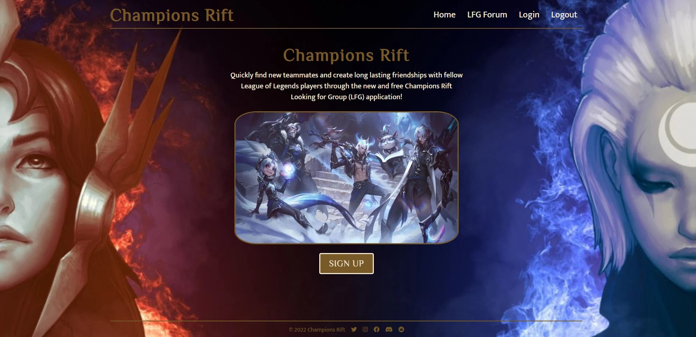

# Title

LFG - League Of Legends

## Table of Contents

If your README is long, add a table of contents to make it easy for users to find what they need.

- [Description](#description)
- [Installation](installation)
- [Usage](#usage)
- [License](#license)
- [Contribution](#contribution)
- [Badges](#license)
- [Test](#test)
- [Github Username](#github%username)
- [Contact me](#contact%me)

## Description

Within this application you will basically creating a posting onto our website for a teamate you would like or teamates. You are allowed to create an account and while creating this account you are going to be giving the site some information that you would like to share with other people. This information is things like your rank, role and also you main champion. You are able to see other postings and comment on them and also add them to your team.

## Installation

For the installation of this application we will be running it within heroku so you wont need to install anything but if you would like to run it within nodeJS you will need to log into mysql "mysql -u root -p" and then type your password in. From the you need to type "source db/schema.sql" this will create the database from there you and type 'quit' in the console. Next you need to do "npm i" this will install all the dependencies you need to run this application. From there all you need to do is type in "node server.js" and this will start the server. Go to localhost3001 to begin using the website.

## Usage

- Use Node.js and Express.js to create a RESTful API.

- Use Handlebars.js as the template engine.

- Use MySQL and the Sequelize ORM for the database.

- Have both GET and POST routes for retrieving and adding new data.

- Use at least one new library, package, or technology that we haven’t discussed.

- Have a folder structure that meets the MVC paradigm.

- Include authentication (express-session and cookies).

- Protect API keys and sensitive information with environment variables.

- Be deployed using Heroku (with data).

- Have a polished UI.

- Be responsive.

- Be interactive (i.e., accept and respond to user input).

- Meet good-quality coding standards (file structure, naming conventions, follows best practices for class/id naming conventions, indentation, quality comments, etc.).

- Have a professional README (with unique name, description, technologies used, screenshot, and link to deployed application).

## License

Apache License 2.0

## Contribution

Alex A.
Vehbi Y.
Jacob R.
Drew Z.

## Badges

## Test

No tests for this application

## GitHub Username

https://github.com/alexarizona00
https://github.com/yilmazvs
https://github.com/Supbake
https://github.com/dlzinck

## Contact me

Alex A. - alexarizona00@gmail.com
Vehbi Y. - yilmazvtc@gmail.com
Jacob R. - jacobnramirez@gmail.com
Drew Z. - dlzincktheii@gmail.com
